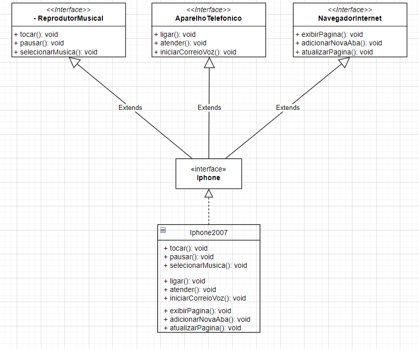

A ideia foi encapsular dentro do pacote "interfaces" todas as funcionalidades do aparelho (nível de pacote) e expor apenas a interface "Iphone" (public) para suas implementações (no caso Iphone2007).

